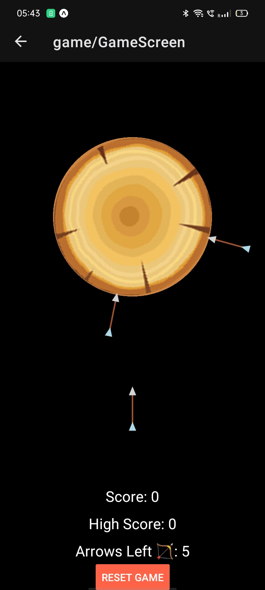

## EasyBuy ✅ E-Comm Application


### Overview
The E-Comm application is a comprehensive e-commerce platform designed to provide users with a seamless shopping experience. Built using React Native, the application features a home screen with a banner slider, a product list fetched from a mock API, detailed product pages, and a fully functional shopping cart. The app is designed with user-friendly navigation and state management to ensure a smooth and engaging user experience.

### Features

#### Home Screen


- **Banner Slider**: The home screen starts with a full-width banner slider that displays promotional images. This is implemented using a `FlatList` component with horizontal scrolling and auto-scroll functionality.


- **Product List**: Below the banner slider, a list of products is displayed. Each product includes an image, name, price, and a brief 2-line description. The product data is fetched from a mock API and rendered using a `FlatList`.

#### Product Details Screen


- **Product Carousel**: When a user taps on a product, they are navigated to a detailed product screen. This screen features a carousel of product images, implemented using a `FlatList` with paging enabled.
- **Detailed Description**: The product details screen also includes a detailed description of the product, providing users with all the necessary information.
- **Add to Cart**: An "Add to Cart" button allows users to add the product to their shopping cart. The button updates the cart state and provides feedback to the user.

#### Shopping Cart Screen


- **Cart Icon**: The shopping cart screen is accessible from the third tab in the bottom tab navigation. The cart tab icon displays the number of items currently in the cart, providing users with a quick overview of their cart status.
- **Cart Management**: The cart screen allows users to view the products they have added to their cart. Users can increase or decrease the quantity of each product, or remove items entirely. This is managed using state hooks and the `useCartStore` custom hook.
- **Total Price**: The total price of the items in the cart is displayed at the bottom of the screen. This is dynamically calculated based on the products and their quantities in the cart.

### Implementation Details

#### Technologies Used
- **React Native**: For building the mobile application.
- **React Native Reanimated**: For smooth animations in the banner slider and product carousel.
- **Expo**: To streamline the development process and manage assets.

#### Core Components
- **Promotion Offer Banner**: Implemented using a `FlatList` with horizontal scrolling and auto-scroll functionality.
- **Product List**: Fetched from a mock API and displayed using a `FlatList`.
- **Product Carousel**: Implemented using a `FlatList` with paging enabled to display product images.
- **Shopping Cart**: Managed using state hooks and a custom `useCartStore` hook to handle cart operations and state.

### How to Use
1. **Home Screen**: Browse through the banner slider and product list.
2. **Product Details**: Tap on a product to view detailed information and add it to your cart.
3. **Shopping Cart**: Access the cart from the bottom tab navigation, manage product quantities, 


# Explore - Arrow Shooting Game

## Overview
GameScreen is an engaging arrow-shooting game built using React Native and Reanimated. The game revolves around a rotating log, and the objective is to shoot arrows onto it without colliding with existing arrows. If an arrow hits another, the game ends.



## Features
- **Rotating Log**: The log continuously rotates, increasing the challenge.
- **Arrow Shooting Mechanic**: Players tap to shoot arrows onto the log.
- **Collision Detection**: If an arrow collides with an existing one, the game ends.
- **Sound Effects**: Shooting and collision sounds enhance the experience.
- **Score System**: Players earn points for successful arrow hits.
- **Level Progression**: The game advances to the next level upon successfully shooting all arrows.
- **Game Over & Restart**: Players can restart the game upon failure.
- **High Score Tracking**: The highest score achieved is stored.

## Implementation Details

### Technologies Used
- **React Native**: For building the mobile application.
- **React Native Reanimated**: To handle smooth animations of rotating logs and arrows.
- **Expo Audio**: To integrate sound effects for shooting and collisions.
- **React State Management (useGameStore)**: To manage game state efficiently.

### Core Components
- **Rotating Log**: The log spins continuously using `useSharedValue` and `useAnimatedStyle`.
- **Arrow Shooting**: Arrows are launched upon a tap and added to the log at calculated angles.
- **Collision Detection**: If an arrow lands too close to an existing arrow, the game ends.
- **Sound Integration**: Sounds are played when an arrow is shot and when a collision occurs.

## Code Breakdown
### 1. **Animation Handling**
The log rotates infinitely using:
```javascript
useEffect(() => {
  rotation.value = withRepeat(
    withTiming(360, { duration: rotationSpeed, easing: Easing.linear }),
    -1
  );
}, [rotationSpeed]);
```
### 2. **Arrow Shooting Mechanism**
- Calculates the new arrow's angle relative to the rotating log.
- Checks for collisions before adding the arrow.
- Triggers sound effects and updates the score.
```javascript
const launchArrow = () => {
  if (remainingArrows > 0 && !gameOver) {
    arrowShootSound();
    const newLocalAngle = normalizeAngle(FIXED_IMPACT_ANGLE - rotation.value + OFFSET);
    if (checkCollision(newLocalAngle)) {
      setGameOver(true);
      playCollisionSound();
      updateHighScore(score);
      Alert.alert("Game Over!", "Arrow collision detected!");
    } else {
      addArrow(newLocalAngle);
      incrementScore();
      decrementArrows();
    }
  }
};
```
### 3. **Collision Detection**
Prevents arrows from being placed too close to each other.
```javascript
const checkCollision = (newLocalAngle) => {
  return arrows.some((existingAngle) => {
    return angleDifference(existingAngle, newLocalAngle) < IMPACT_THRESHOLD;
  });
};
```
### 4. **Sound Effects**
Adds sound for a better user experience.
```javascript
const playSound = async (soundFile) => {
  const { sound } = await Audio.Sound.createAsync(soundFile);
  await sound.playAsync();
  sound.setOnPlaybackStatusUpdate((status) => {
    if (status.didJustFinish) {
      sound.unloadAsync();
    }
  });
};
```

## How to Play
1. Tap anywhere on the screen to shoot an arrow.
2. Avoid hitting existing arrows on the rotating log.
3. Successfully place all arrows to progress to the next level.
4. If an arrow collides, the game ends, and the player can restart.

## Future Enhancements
- **Increasing Difficulty**: Speeding up the rotation in higher levels.
- **Different Log Sizes**: Introducing various log shapes and sizes.
- **Power-Ups**: Adding special power-ups like slow-motion.
- **Leaderboard**: Implementing global score tracking.

This game provides a fun and challenging experience while utilizing smooth animations and real-time state management. Enjoy playing!

